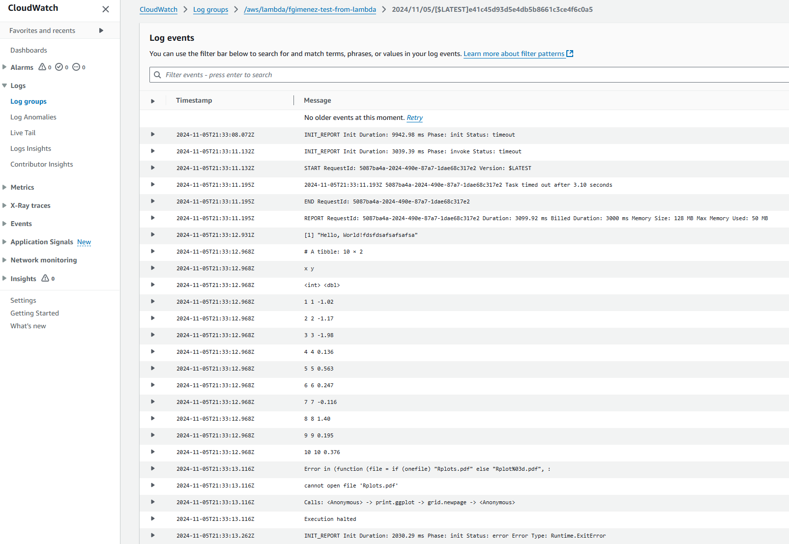
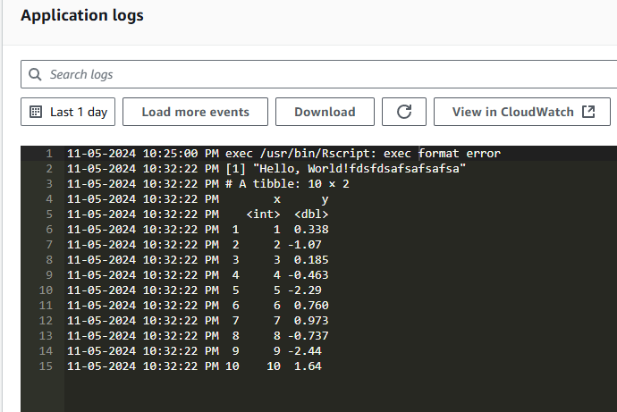

## First create an AWS ECR and login

```
aws ecr get-login-password --region eu-west-1 | docker login --username AWS --password-stdin ACCOUNTNUMBER.dkr.ecr.eu-west-1.amazonaws.com
```

## Then upload the image to the Registry  
```
docker tag IMAGEID ACCOUNTNUMBER.dkr.ecr.eu-west-1.amazonaws.com/registry:latest
docker push ACCOUNTNUMBER.dkr.ecr.eu-west-1.amazonaws.com/registry:latest
```

I was able to make it work with errevolume instead erreubuntu:  
```
docker pull ghcr.io/vindrogames/errevolume:latest
```

Tested both

Lambda with containers



AWS Apprunner

